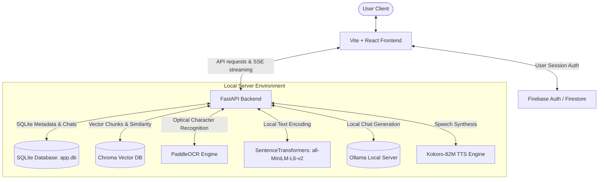
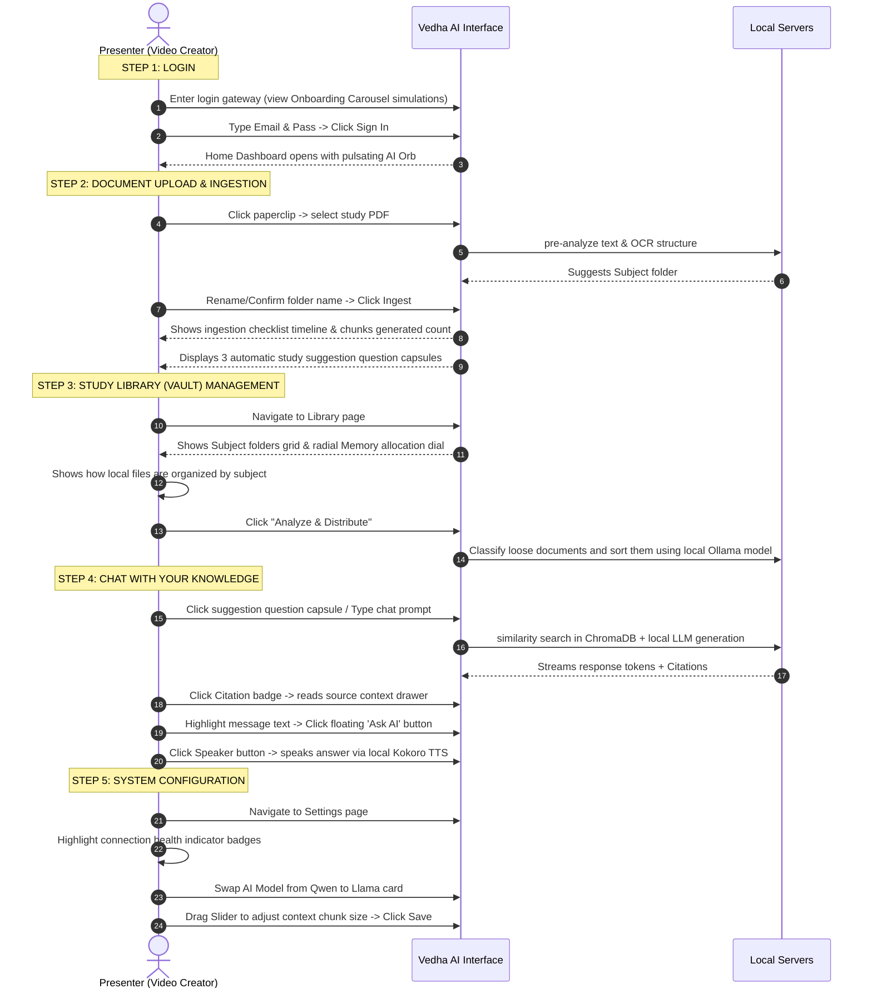

# Vedha AI — SaaS Application Workflow & End-to-End User Guide

Welcome to the **Vedha AI** SaaS application workflow guide. This document details the step-by-step user journey, user interface layouts, interactive behaviors, and underlying technical workflows of the application. It serves as a presentation script/cheat sheet for recording walkthrough videos, and as technical system-flow reference documentation.

---

## Technical Overview of the Architecture

Vedha AI is a **100% private, secure, offline Retrieval-Augmented Generation (RAG)** platform designed to let students, developers, and researchers analyze documents (PDF, DOCX, PPTX, Images, TXT) locally.



---

## Phase 1: Login & Registration Gateway

**File Path:** [Login.tsx](file:///e:/vs%20code/vedha%20Ai/src/components/Login.tsx)

The application starts at the secure Login Gateway. The screen is split into two panels: an interactive onboarding panel on the left and a secure credentials form on the right.

### 1. Interactive Onboarding & Feature Carousel (Left Side)
* **Visuals & Design:** Dynamic glassmorphism panel backdropped by floating glowing blue and purple vector shapes. Features a dynamic carousel showing the main features of the app.
* **Carousel Behavior:** 
  * The onboarding steps automatically transition every **6 seconds** (using Framer Motion).
  * Hovering or clicking step icons lets the user select that step manually.
  * **Simulated Visualizations:** Each step renders a miniature interactive simulation:
    1. **Build Your Knowledge Base:** Shows a moving laser beam particle transferring files into an "Indexed DB" node.
    2. **Chat Private & Offline:** Simulates a chat dialogue, rendering text response token-by-token with a typing cursor.
    3. **Auto-Compile Quizzes:** Renders an interactive multiple-choice question where a mouse pointer automatically selects the correct answer, displaying a green checkmark check.
    4. **Review Analytics:** Animates a telemetry panel plotting speeds (e.g. `12 ms`), database chunks (`1,420 Ch`), and accuracy (`99.4%`) with a drawn SVG trendline.

### 2. Multi-Stage Credentials Form (Right Side)
* **Sign In Flow:**
  1. **Email Entry:** The user enters their email. The system runs an async check against local registry cache (`localStorage`) and Firestore. Click **Continue**.
  2. **Password Entry:** If the account exists, the form transitions to the password field. The user inputs their password and logs in.
* **Sign Up Flow:**
  * Clicking "Sign Up" changes the state. The user enters their email, password, and confirmation password, then clicks **Get Started** to create a Firebase authenticated account.
* **Aesthetics:** A responsive design featuring a custom Lottie animation (glowing digital network sphere) at the bottom center.

---

## Phase 2: Home Dashboard (Central Workspace)

**File Path:** [Home.tsx](file:///e:/vs%20code/vedha%20Ai/src/pages/Home.tsx)

Upon logging in, the user lands on the Home screen. This is a clean search-centric interface centered around the interactive **AI Orb**.

```text
+-------------------------------------------------------------+
|  [Logo] Vedha AI             [Clock] 17:38    [User Avatar] |
+-------------------------------------------------------------+
|                                                             |
|                          (( ORB ))                          |
|                                                             |
|                    Welcome to Vedha AI                      |
|              Offline AI Companion for [Students]            |
|                                                             |
|   +-----------------------------------------------------+   |
|   | Ask Vedha anything or search your knowledge...      |   |
|   | [Paperclip] [Mic] [Scan]                       [Up] |   |
|   +-----------------------------------------------------+   |
|                                                             |
|    [Learn Topic] [Interview Prep] [Summarize Notes] ...     |
+-------------------------------------------------------------+
```

### 1. Navigational Header & Digital Clock
* **Digital Clock:** The navbar contains a live digital clock (`useClock.ts`) displaying the local time.
* **Rotating Text Banner:** A welcome heading featuring a custom rotating text component showcasing rotating keywords: `Students`, `Coding`, `DSA Prep`, `Interviews`, `Learners`.

### 2. The Interactive AI Orb (`AiOrb.tsx`)
* **States:** Transitions dynamically between states:
  * **Idle:** Pulsating light-blue glowing halo.
  * **Listening:** Active expanding red sound waves (simulated audio capture).
  * **Processing:** Spinning purple/indigo neon orbits.
* **Voice Action:** Clicking the Orb toggles offline voice transcription mode (mocked with speech-to-text feedback) which pre-fills the query box.

### 3. Smart Document Ingestion Pipeline (2-Stage Upload)
To index local knowledge:
1. **Trigger Upload:** Click the **Paperclip** button. Select a file (PDF, Docx, PPTX, TXT, Images).
2. **Stage 1 (Pre-Analyze):** The file is uploaded to `POST /api/upload/pre-analyze`. 
   * **OCR Pipeline:** If the file is an image or scanned document, the server starts Baidu's **PaddleOCR** offline to extract the text.
   * **AI Subject Suggestion:** The server reads the first 6,000 characters of text, runs an Ollama classification, and auto-detects a suggested subject/folder name (e.g. *"Physics"* or *"Java Programming"*).
3. **Stage 2 (Confirm & Index):** A modal displays the document statistics (character counts, type, suggested folder). The user can accept the category name or type a custom one. Click **Confirm & Index**.
   * The client posts to `/api/upload/finalize`. The backend splits the document text into tokens (e.g., `512` chunks with `64` overlap), encodes them into 384-dimensional vector embeddings, and stores them in ChromaDB.
   * **Timeline Progress:** Home screen renders an **Ingestion Pipeline Checklist** card showing the stage status: *Step 1: Parse & Extract Text*, *Step 2: Topic Analysis*, and *Step 3: Vector Embeddings Chunking* showing the number of chunks generated.
   * **Question Generator:** The server triggers an asynchronous task to generate 3 custom study questions based on the document. These are displayed as clickable suggestion capsules below the search bar.

### 4. Input Bar & Inline RAG Assistant
* **Action Tray:** Includes paperclip upload, microphone voice capture, and a **Scan** button (simulates OCR scanner on receipt logs).
* **Inline Response Panel:** Pressing Enter streams the answer.
  * **SSE Streaming:** FastAPI backend streams tokens word-by-word via Server-Sent Events (SSE).
  * **Telemetry Bar:** Displays vector DB statistics: chunk counts, DB memory size, active LLM model, and offline Ollama connection status.
  * **Citations Panel:** Shows clickable tabs of the referenced file sources.
  * **Voice Synthesis:** A speaker button calls the **Kokoro-82M Text-to-Speech** offline endpoint to speak the answer aloud.
  * **Follow-up Routing:** If a query is submitted while an inline answer is already active, the app automatically redirects the user to the Chat page to preserve conversational context.

---

## Phase 3: Study Library & Folder Management (Vault)

**File Path:** [Vault.tsx](file:///e:/vs%20code/vedha%20Ai/src/pages/Vault.tsx)

The Vault page organizes all ingested files into subjects.

### 1. Subjects Grid & View Toggle
* **View Modes:** Toggle between a **Grid View** (modern visual cards) and a **List View** (compact directory format).
* **Subject Cards:** Show folder description, notes count, files count, last-updated timestamp, and a **Syncing Progress indicator** (toggles status badge from *Syncing* to *Synced*).

### 2. AI Auto-Sorting ("Analyze & Distribute")
* **Goal:** Intelligently organize unstructured loose documents without manually dragging files.
* **How it works:** Click the **Analyze & Distribute** button.
  * Calls `/api/documents/analyze-distribute`.
  * The backend triggers Ollama to scan loose files, extract topic keywords, create matching Subject folders if missing, and relocate files into folders automatically.

### 3. Storage Telemetry dials
* **Vector Memory Gauge:** An SVG radial stacked ring showing the physical database memory allocation (e.g. `0.218 GB` used of `10 GB` max allocation).
* **System Logs Feed:** A scrollable dark console container feeding live OCR extraction events.

### 4. Collection details Drawer
* Clicking a subject card slides out a sidebar details drawer:
  * **Rename Subject:** Double click to edit the folder name.
  * **Direct upload:** Upload files directly into the active folder.
  * **Files Table:** Manage files within this collection (displays status, file sizes, and includes a **Delete** button).

---

## Phase 4: Multi-Thread Chat Client

**File Path:** [Chat.tsx](file:///e:/vs%20code/vedha%20Ai/src/pages/Chat.tsx)

The Chat page offers a multi-turn conversation workspace with full RAG capability.

```text
+-----------------------+-------------------------------------------------+
| [Thread Sidebar]      | Context: [ All Databases | v ]  Mode: [ Quiz ]  |
|                       |                                                 |
| +-------------------+ | [Bot] Here is a summary of the Java notes:      |
| | New Thread        | |   ### Object Oriented Principles                |
| +-------------------+ |   - **Encapsulation**: Hiding state...          |
|                       |   - **Polymorphism**: Dynamic dispatch...       |
| * Java OOP            | |                                                 |
| * Physics Revision    | | [Citations: Java_OOP_Cheat_Sheet.txt]           |
| * System settings     | +-----------------------------------------------+
|                       | [ Input box...                             [Up] |
+-----------------------+-------------------------------------------------+
```

### 1. Thread Sidebar (Left Panel)
* **Thread Management:** Create new threads, rename thread titles, or delete conversation history. Collapses out of view to save space.

### 2. Context Filters & Learning Modifiers (Top Header)
* **Subject Filter Dropdown:** Limits RAG context searches. Select "All Databases" to query the entire library, or restrict queries to a single Subject folder (e.g. *"Physics"*).
* **Chat Mode:** Adjusts the AI persona response format:
  * **Learning:** Comprehensive tutorial breakdowns.
  * **Interview Prep:** Prompts the AI to act as a technical interviewer testing skills.
  * **Summarize Notes:** Formats responses into study summaries.
  * **Quiz Me:** Generates multiple-choice quizzes.
  * **Explain PDF:** Explains the document currently in view.
* **Explanation Level:** Choose complexity: `Beginner`, `Intermediate`, or `Advanced`.

### 3. Chat Window
* **Markdown Parsing:** Dynamic rendering of bold highlights, itemized lists, tables, and code snippets (which feature a **Copy** button).
* **Interactive Citations:** Clicking a citation button opens a contextual drawer displaying the exact raw text snippet retrieved from ChromaDB.
* **Text Selection Menu:** Select text within any message bubble to open a floating helper menu. Choose **Ask AI** or **Look up** to immediately run a query about the highlighted text.
* **Generation Controls:**
  * **Stop Generation:** Interrupts Ollama inference mid-stream, saving the partial response.
  * **Edit Message:** Click the edit icon on any user prompt to change it. Submitting deletes subsequent messages and regenerates the thread.
  * **Regenerate:** Request another response for the latest query.
  * **Kokoro TTS:** Read messages aloud.
* **Web Search Toggle:** Option to query the web instead of the local knowledge base.

---

## Phase 5: System Settings & Model Switcher

**File Path:** [Settings.tsx](file:///e:/vs%20code/vedha%20Ai/src/pages/Settings.tsx)

The settings page configures LLMs and adjusts RAG parameters.

### 1. Service Connection Status
* **Check Connections:** Displays status indicators for the FastAPI backend (`http://localhost:8000`) and local Ollama (`http://localhost:11434`).
* **Available Models:** Queries Ollama tags API and lists all weights downloaded on the machine.
* **Ollama Offline Helper:** If Ollama is offline, displays a diagnostic warning alert showing user terminal instructions (`ollama run qwen2.5:3b`) with a clipboard copy utility.

### 2. Offline LLM Selector
* Displays a card grid of models:
  * **Qwen 2.5 3B (GGUF):** Balanced speed and performance (`18.5 tok/s`).
  * **Llama 3.1 8B:** Large model for summarizing (`8.4 tok/s`).
  * **Phi-3 Mini:** Micro model optimized for lightweight CPUs (`14.2 tok/s`).
* Selecting a model calls `updateSettings` on the backend to swap the active LLM context immediately.

### 3. RAG Parameter Sliders
* **Context Chunk Size:** Adjust the text segment length (128 to 1024 tokens) using a range slider.
* **Chunk Overlap:** Adjust the overlap boundary size (16 to 256 tokens) to prevent context splitting.
* **OCR Options:** Set PaddleOCR presets (`High Accuracy` or `Fast Parse`) and enable/disable structure and multi-column document flow parsers.

### 4. Database Operations
* **Force Reindex:** Recalculates vector embeddings for all documents (renders a live progress loader bar).
* **Backup Index:** Exports database configurations as a JSON backup file.
* **Format Database:** Wipes SQLite tables and clears localStorage (prompts user confirmation first).

---

## Complete E2E Showcase Script (Video Outline)

Use this flowchart script sequence to record a video showcase:



This guide details the complete SaaS workflow of Vedha AI. Use it as a roadmap for presentations, demo video recordings, or future feature development.
