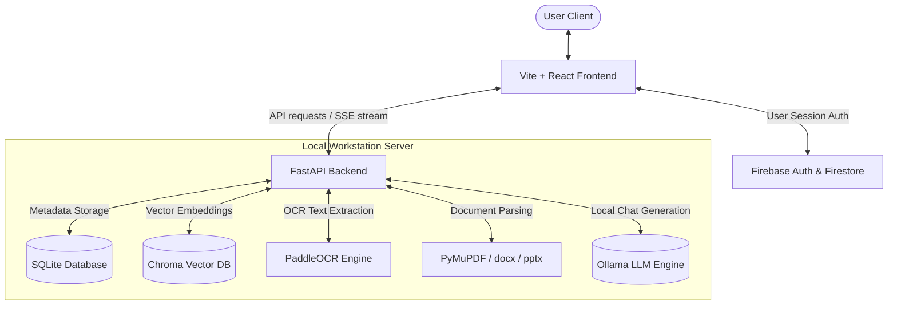
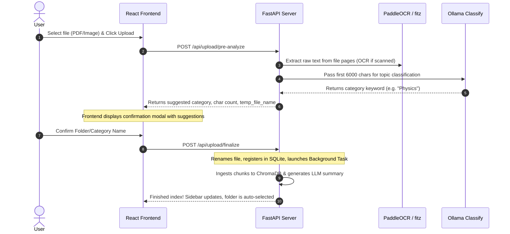
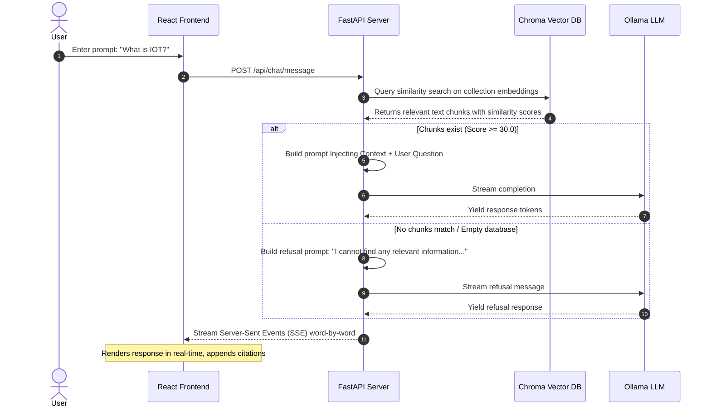

# VEDHA AI: Offline Private Learning & RAG Assistant
## Technical Architecture & Showcase Guide

Welcome to the **Vedha AI** Showcase Guide. This document serves as a complete reference for your upcoming showcase meeting. It explains the core problems solved, the detailed system architecture, system data flows, toolsets, and includes a comprehensive FAQ prep section to help you confidently answer any technical questions.

---

## 1. Core Problem Statement

Most modern AI assistants (like ChatGPT, Claude, or Gemini) require active internet access and transmit sensitive user documents to remote cloud servers. This introduces three major challenges:
1. **Data Privacy Risks**: Uploading proprietary textbooks, academic notes, research papers, or corporate PDFs to third-party APIs compromises privacy.
2. **Internet Dependency**: Students and educators in isolated, restricted, or remote network environments cannot access the learning tools.
3. **Hallucination & Lack of Structure**: General LLMs answer questions based on general knowledge, which leads to hallucinations when referencing specific, structured learning curriculum.

### The Solution: Vedha AI
Vedha AI is a **private, secure, and entirely offline Retrieval-Augmented Generation (RAG)** assistant. It lets users upload study documents (PDFs, Docx, PPTX, Images) to custom subject folders (collections), indexes them locally, and uses a local Ollama LLM to answer questions strictly from the uploaded materials, with zero cloud dependency.

---

## 2. High-Level System Architecture

Vedha AI is split into a modern web client and a lightweight, high-performance local FastAPI server:

---

## 3. Technology Stack & Tool Matrix

Here is the exact tool matrix representing every core library and service in the system:

| Layer | Technology | Purpose |
| :--- | :--- | :--- |
| **Frontend UI** | **React (TypeScript)** | Single Page Application framework for responsive UI state management. |
| **Frontend Styling** | **Vanilla CSS + Tailwind CSS** | Clean glassmorphism styling, responsive layouts, dark modes, and slide-in bubble animations. |
| **Animation** | **Framer Motion** | Controls transition states, modal backdrops, and ingestion step transitions. |
| **User Authentication**| **Firebase Auth & Firestore** | Manages student credentials and persists active configuration values. |
| **Icons** | **Lucide React** | Visual representation of file types, folders, copy buttons, and speaking triggers. |
| **Backend Framework** | **FastAPI (Python)** | Web framework optimized for high-throughput async request routing and streaming SSE packets. |
| **RAG Ingestion** | **ChromaDB** | High-speed, local vector database for storing text chunk embeddings. |
| **Local LLM Runner** | **Ollama (`qwen2.5:3b`)** | Powers offline text generation, document classification, and summary extraction. |
| **Local Text Encoder** | **HuggingFace `sentence-transformers`** | Encodes text chunks into dense 384-dimensional vector embeddings. |
| **Doc Parsers** | **PyMuPDF (fitz)** | Extract text contents page-by-page from PDF files. |
| **OCR Pipeline** | **PaddleOCR (Baidu)** | Runs offline deep learning character recognition on scanned PDFs and images. |
| **Office Parsers** | **python-docx & python-pptx** | Scans Microsoft Word documents and PowerPoint slide structures. |
| **Local DB** | **SQLite (SQLAlchemy)** | Persists chat sessions, thread histories, metadata, and document index status. |
| **Speech Generation** | **Kokoro-82M TTS** | Runs local Text-to-Speech synthesis for reading assistant answers. |

---

## 4. Key System Data Flows

### A. Two-Stage Document Ingestion Pipeline
To keep user files organized and categorized without manual tagging, Vedha AI uses an intelligent two-stage upload pipeline:

### B. Offline RAG Chat Pipeline
When the user sends a question, the system retrieves only the most relevant sections of the files, bypassing LLM context window limits:

### C. Chat History PDF Export
To share conversation threads, the system renders a clean document transcript:
1. The user clicks **Export PDF** on the Chat page.
2. The browser triggers `window.open` to `GET /api/chat/sessions/{session_id}/export-pdf`.
3. The backend retrieves the session metadata and sorts its messages chronologically using SQLite.
4. The backend initializes a PyMuPDF (`fitz`) Document, draws an Indigo brand header banner, and writes the messages page-by-page.
5. It handles **word wrapping** (75 chars max width) and **dynamic pagination** (whenever text height exceeds page margins, it appends a new A4 page).
6. It returns a `FileResponse` carrying the PDF stream, prompting the browser to save it locally.

---

## 5. Showcase Q&A Preparation (Meeting Cheat Sheet)

Be prepared to answer these questions during your project presentation:

### Q1: How does the system handle scanned PDFs vs. searchable PDFs?
> **Answer**: We use PyMuPDF (`fitz`) first because it's fast at extracting native text. If a page returns an empty text string (meaning it is a scanned image of text), the server initializes Baidu's **PaddleOCR** offline. It extracts page images, runs local optical character recognition, retrieves the text, cleans it, and feeds it into the database chunker.

### Q2: Why did we choose ChromaDB instead of a cloud database like Pinecone?
> **Answer**: Since the system is designed to run entirely **offline and local**, a cloud database like Pinecone violates our core privacy guarantee. ChromaDB is a lightweight vector database that runs inside our local Python process, saving vector embeddings directly to the local disk. It is fast, private, and has zero network overhead.

### Q3: What happens if there are no documents matching the query in the database?
> **Answer**: The system uses a strict threshold check. If the vector database searches for documents and all returned chunks have a similarity score below a set threshold, it prevents the LLM from using general pre-trained knowledge. It restricts the LLM to output a clean refusal message: *"I cannot find any relevant information in the uploaded source documents to answer this question."* This prevents AI hallucinations.

### Q4: How is Firebase integrated if the server runs locally?
> **Answer**: Firebase is used on the **frontend web client** to handle user login, registration, and user profiles. This enables secure individual student accounts. The local FastAPI server handles the heavy lifting of PDF extraction, indexing, and LLM inference.

### Q5: How does the SSE streaming work?
> **Answer**: Standard REST APIs wait for the LLM to finish generating the entire response, leading to a long delay (10-15 seconds). We use **Server-Sent Events (SSE)**. As soon as the local Ollama LLM outputs a single token (word), the FastAPI server wraps it in a JSON block and yields it to the client. The React app decodes the chunks in real-time, rendering the text smoothly as it generates.
